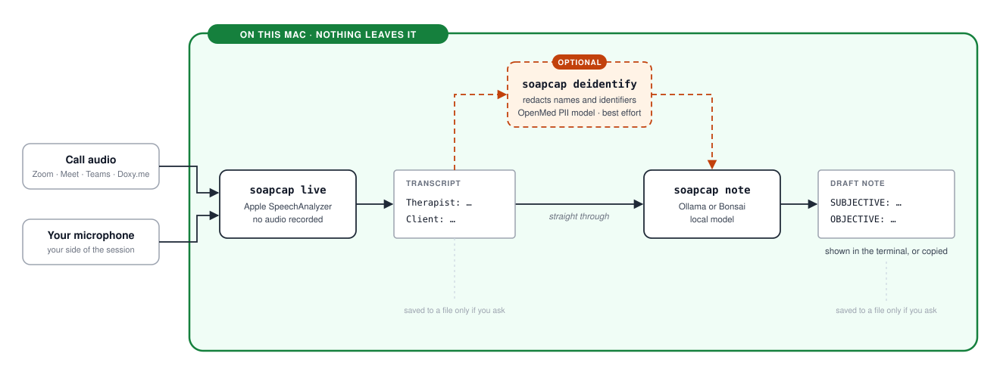

# soapcap

Capture a **speaker-attributed transcript of a telehealth session** on a Mac
using only Apple's on-device speech recognition — no cloud, no Whisper
download, no virtual audio devices, and by default **nothing written to
disk**.

`soapcap note` then drafts a SOAP/DAP/BIRP note from that transcript with a
**local model** (llama3.1:8b via Ollama, or the optional Bonsai), and
`soapcap deidentify` can redact names and other identifiers first. Nothing
leaves the machine. `soapcap session` walks through all of it with prompts.

---

## How it works

<picture>
  <source media="(prefers-color-scheme: dark)" srcset="assets/how-it-works-dark.svg">
  
</picture>

`soapcap` never talks to Zoom or any meeting API — it captures **system
audio** (whatever your Mac is playing) plus your **microphone**, so it works
with any conferencing tool.

---

## Requirements

- **macOS 26 (Tahoe) or newer, Apple silicon.** Non-negotiable — `yap`
  hard-fails on anything older or on Intel.
- [Homebrew](https://brew.sh)
- **Headphones recommended, not required.** See
  [Without headphones](#without-headphones).
- **For `note`**: [Ollama](https://ollama.com) and ~5GB free memory beyond
  whatever else is running (default model `llama3.1:8b`). Optional — capture
  and transcription work without it. The optional **Bonsai** model instead
  needs a 16GB+ Mac, Xcode Command Line Tools, and ~6GB of disk — see
  [Draft a note](#draft-a-note).
- **Optional polish**, both auto-detected, neither required: **gum** (nicer
  `session` prompts) and **fzf** (browse for a transcript file in `note`).
  See [Setup in detail](docs/setup.md#nicer-prompts-and-file-picking).

---

## Install

```sh
git clone https://github.com/pglockner/soapcap.git
cd soapcap
./install.sh          # brew install yap jq (force-linked — macOS 26 ships
                       # its own /usr/bin/jq, which can otherwise shadow
                       # Homebrew's), symlink onto PATH, run doctor,
                       # offer a Desktop shortcut + gum + fzf, then ask
                       # which note model(s) to set up — llama3.1:8b,
                       # Bonsai, both, or none (re-runs only offer what
                       # isn't installed yet)
```

No git installed? Click **Code → Download ZIP** on the
[GitHub page](https://github.com/pglockner/soapcap), unzip it, then `cd`
into the extracted folder and run `./install.sh` the same way — nothing in
soapcap depends on `.git` being present.

Grant permissions **to the terminal app you run `soapcap` from** (Terminal,
iTerm, etc.), then fully quit and reopen it:

1. **System Settings → Privacy & Security → Microphone** → enable your terminal
2. **System Settings → Privacy & Security → Screen Recording** → enable your
   terminal (system-audio capture rides on this permission)

Then verify:

```sh
soapcap doctor
```

`doctor` checks the Mac, `yap`, `jq` and the capture permissions, then reports
whether Ollama, Bonsai, `gum` and `fzf` are present. Those last four are
informational: `live`/`transcribe` work without any of them.
[Setup in detail](docs/setup.md) has the expected output, the by-hand
install steps, and the optional extras.

Switch the `session`/`note` default between `llama3.1:8b` and `bonsai` any
time with `soapcap model` — see [Draft a note](#draft-a-note).

Optional config: `cp config.example.sh ~/.config/soapcap/config.sh` and edit
(speaker labels, locale, note model/format, dedupe tuning).

---

## Usage

### Live session

```sh
soapcap live
```

1. Start your session in Zoom/Meet/Teams/etc.
2. Turn on **Do Not Disturb** — a stray notification sound lands in the
   transcript otherwise.
3. Run `soapcap live`. A one-line timer shows it's recording.
4. **q, x, or Ctrl-C** stop for good; **p or space** pauses — see
   [Pause/resume](#pauseresume). No keyboard available (backgrounded or
   scripted)? `kill -TERM` stops it the same way Ctrl-C would, no pause.

`yap` finalizes and the transcript prints to stdout:

```
Therapist: How have things been since we last met?
Client: Honestly pretty rough. I haven't been sleeping.
Therapist: Tell me about the sleep.
...
```

Write it to a file instead (this file contains PHI — you own its deletion):

```sh
soapcap live --out ~/sessions/2026-09-10.transcript
```

Other flags: `--mic-label`, `--system-label`, `--locale`, `--keep-json FILE`
(also save the raw `yap` JSON with timestamps), `--clipboard`.

### Existing recording

```sh
soapcap transcribe recording.m4a
soapcap transcribe recording.m4a --out out.transcript
```

For a file you already have (e.g. a QuickTime capture or a test clip). No speaker separation — single audio track, every line is
`Speaker:`.

### Draft a note

```sh
soapcap live | soapcap note                       # pipe straight through
soapcap note ~/sessions/2026-09-10.transcript      # or from a saved file
soapcap note --format dap --out ~/notes/draft.md   # DAP instead of SOAP
```

Sends the transcript to a **local** model (default `llama3.1:8b` via
Ollama). The prompt (`prompts/*.md` — read or edit it directly) requires: use only
what's in the transcript, never assign an undiscussed diagnosis, always
surface anything suggesting risk (self-harm, harm to others, abuse, crisis),
and write "Not addressed in this session" rather than pad a section out.
Formats: `soap` (default), `dap`, `birp`.

**Read every note before it goes near a chart.** It's still an LLM. Mistakes
concentrate in the Objective section. In a SOAP note it's a mental-status
judgment made from text alone; in DAP/BIRP, telling an actual in-the-room
observation apart from a client's own description of how they've been
feeling. Either way, a smaller model can invent detail that isn't there or
miss detail that is.

| Model | Size | Notes |
|---|---|---|
| `llama3.1:8b` | ~5GB | **Default.** Fast: 1–2 minutes a SOAP note. Proofread pronouns and facts. |
| `bonsai` | ~6GB (16GB+ Mac) | Slower (4–8 minutes a SOAP note), more accurate. Set up with `tools/bonsai/install.sh`. |

`soapcap model` shows both with their live status and picks the default for
`session`/`note`; `--model` overrides it per run.

`--style` (or `SOAPCAP_STYLE`) chooses how the note is produced: `narrative`
(default, the model writes prose), or the experimental `structured` (the
model fills in fields, soapcap checks them and writes the note) and
`combined` (a narrative note plus a review of it printed to the terminal).

To try it without a real session, use the fictional transcripts in
[`samples/transcripts/`](samples/transcripts/). Its README explains what
each one tests, for prompt tuning and for de-identification.

Other flags: `--style STYLE`, `--duration MINUTES`, `--host URL`, `--clipboard`.
`--host` is for an Ollama on this Mac at another port; pointed at any other
machine it sends the transcript there, and soapcap warns when it does.

[Notes in detail](docs/notes.md) covers the SOAP house format (the separate
Objective pass, the SI/HI line, Plan, the session line), the drafting status
line, setting up Bonsai, other models, and the note styles.

### De-identify

```sh
soapcap live | soapcap deidentify | soapcap note
soapcap deidentify ~/sessions/2026-09-10.transcript --out ~/sessions/2026-09-10.deid.transcript
```

Runs a transcript through a small **on-device** PII detection model
([OpenMed](https://github.com/maziyarpanahi/openmed)'s, via Apple's MLX
runtime — Apple Silicon only, same as the rest of soapcap) and replaces
detected names, phone numbers, emails, addresses, and similar identifiers
with consistent bracketed placeholders (`[FIRST_NAME_1]`, `[PHONE_1]`, …) —
the same person or detail gets the same placeholder everywhere it's tagged,
so a note drafted from the result still reads coherently. Speaker labels
(`Therapist:`/`Client:`) are never touched, even if a label happens to be
someone's real name.

It's an optional extra. `install.sh` offers to set it up, or run it any time:

```sh
tools/deidentify/install.sh    # ~700MB, a few minutes; needs no Python or
                               # Xcode, and installs into
                               # ~/.local/share/soapcap/deidentify
```

The install downloads the model once (no transcript data involved). After
that, de-identifying never uses the network. Details are in the
[helper's README](tools/deidentify/README.md).

**This is a best-effort pass, not a certified de-identification.** It
redacts what the model tags, plus a few narrow rules (month names, numbers
of seven or more digits, and repeats of a name it already tagged; see
[the helper's README](tools/deidentify/README.md#rule-based-detections)),
and nothing more — a missed mention
stays in the output verbatim, and the output is still confidential
clinical material. Read it before sending it anywhere. See
[Legal](#legal--read-before-first-use).

Other flags: `--out FILE`, `--clipboard`.

### Guided session

```sh
soapcap session
```

`session` captures live, then walks through the rest with prompts. It runs
on the terminal's alternate screen buffer (see [Retention](#retention)), so
it looks like a full-screen app and clears when you press Enter at the end.

Before recording starts, `session` checks that the note model can be
reached (Ollama running and the model pulled, or Bonsai set up). It says
nothing when all is well; otherwise it says what to fix and asks whether to
record anyway.

1. **De-identify?** Only asked if [de-identify](#de-identify) is set
   up. One yes/no: yes redacts the transcript (the redacted text is what
   is displayed, drafted from, and copied), and redacts the drafted note
   again before it's shown. If redaction succeeds, it then asks **Save the
   de-identified transcript?** (default **no**). Yes writes it to
   `~/soapcap/transcripts/<date>-<time>.deid.transcript`
   (`SOAPCAP_SAVE_DIR`), readable only by you. Deliberately not
   `~/Documents`, which iCloud Drive often syncs. `note`'s file picker finds it later. It's still
   best-effort redaction, so read it before sharing and delete it when
   you're done.
2. **Show the transcript?** A transcript or note taller than the window
   opens in a pager (Space or the arrow keys scroll, **q** carries on),
   since this screen has no scrollback.
3. **Draft a note?** (worded "Draft a de-identified note?" if you said yes
   to step 1): **soap / dap / birp / no**, with your configured format
   (`SOAPCAP_FORMAT`, SOAP unless you set it) first, so Enter drafts that.
   The model is your default ([`soapcap model`](#draft-a-note)), or
   `--model`.
4. **This draft: copy to clipboard / regenerate / try *other model* /
   discard.** `copy to clipboard` ends the session with the note on the
   clipboard; `regenerate` drafts again with the same model, which stays
   loaded meanwhile; `try …` drafts again with another installed model (one
   is offered by name, several as `switch model`); `discard` ends with no
   note. The note opens with the session line (e.g. `63 minutes,
   telehealth`) — recording time, pauses excluded; see
   [Draft a note](#draft-a-note). If a SOAP draft comes out with no
   Subjective section, it first offers to **save the transcript** (default
   **no**) to `~/soapcap/transcripts` (`SOAPCAP_SAVE_DIR`) and shows the
   file in Finder. With de-identification set up, it offers to
   de-identify first; otherwise the saved file is the original transcript.
   If drafting fails, the choices are **retry / try *other model* / copy
   transcript / quit**, so the session isn't lost to a model that wasn't
   running.

Enter takes the default at every prompt; without
[gum](docs/setup.md#nicer-prompts-and-file-picking), a bare first letter works too (`r`
for regenerate, `b` for birp). `--format` and `--no-note` skip the note
question; `--clipboard` forces the copy on non-interactive runs. Every
`live`/`note` flag still applies. This is what double-clicking
`soapcap.command` runs — see [Clickable shortcut](#clickable-shortcut).

To be asked less, answer the yes/no questions ahead of time in
`~/.config/soapcap/config.sh` — `SOAPCAP_SESSION_DEIDENTIFY`,
`SOAPCAP_SESSION_SAVE_TRANSCRIPT`, `SOAPCAP_SESSION_SHOW_TRANSCRIPT` and
`SOAPCAP_SESSION_NOTE` each take `yes` or `no`; see `config.example.sh`.

**Multiple clients in one session (couples, families):** redaction replaces
each name with a numbered token, and the drafting model tends to write "the
client" or "the couple" rather than track who is who, so the note may lose
who said or did what. Decline de-identification if that attribution matters.

### Pause/resume

Press **p** (or space) while recording; **p** again to resume. Pausing stops
`yap`, so nothing is captured while paused; a fresh capture starts on
resume. Multiple cycles are stitched into one transcript, in order, and the
recording timer carries on from where it paused. **q** or Ctrl-C while
paused stops for good, keeping what was recorded.

Keypresses need a real terminal (`soapcap.command` and a normal interactive
run both qualify). Backgrounded/piped invocations fall back to signal-only
control — Ctrl-C / `kill -TERM` to stop, no pause.

---

## Clickable shortcut

`soapcap.command` at the repo root is a double-clickable entry point —
Finder opens `.command` files in Terminal.app automatically and runs
`soapcap session` there. `update.command` is a second one that runs
`git pull` in the repo. `install.sh` offers to put both on your Desktop.

The first double-click of a copy that came from a ZIP download, AirDrop or a
USB drive is blocked by Gatekeeper; allow it once under **System Settings →
Privacy & Security → Open Anyway**. Details, icons and a keyboard shortcut
are in [Setup in detail](docs/setup.md#clickable-shortcut).

---

## Without headphones

`yap`'s speaker labels are **which audio source** picked up the words, not a
voiceprint. Without headphones, whatever plays through your speakers is
heard by your mic too and transcribed a second time under your label.
`soapcap live` runs a **dedupe pass** by default that drops those echoes,
erring toward keeping lines; `--no-dedupe` shows the raw output. Headphones
(even one earbud) remain the more reliable fix.
[Capture in detail](docs/capture.md) has the tuning settings and why voice
diarization isn't wired in.

---

## Retention

- **No audio file is ever created on the `live` path** — `yap
  listen-and-dictate` transcribes in real time and never records audio.
  Nothing to clean up, by construction.
- **With no flags, nothing survives the run.** `yap` writes its growing
  JSON to a file in a `chmod 700` `$TMPDIR` directory (holding only that,
  `yap`'s stderr, and one file per recorded leg after a pause); every exit
  soapcap gets to act on — a normal stop, Ctrl-C, `kill`, a closed window,
  an error — `rm -rf`s it. A `kill -9` or a power cut can't be cleaned up
  after; `$TMPDIR/soapcap.*` is where to look.
- **`session` only offers to save de-identified text.** Its "Save the
  de-identified transcript?" prompt (default no) appears only after
  redaction succeeds. The one exception is for troubleshooting: when a SOAP
  draft comes out with no Subjective section, `session` offers (default no)
  to save the transcript so the cause can be found, and that file is the
  original transcript unless you de-identify it at that prompt.
- `--out` / `--keep-json` on the command line are explicit opt-ins that
  write exactly what was captured. All of these files hold PHI and are
  **your responsibility to delete** — `rm` on an APFS SSD doesn't overwrite
  data, so there's no "secure erase" claim here; not writing the file, or
  keeping it on an encrypted volume, is the safe path. Keep these files
  out of any folder that syncs to a cloud service — iCloud Drive's
  "Desktop & Documents Folders" option, Dropbox, and the like — since
  that sends PHI to a third party.
- Your **terminal scrollback** holds whatever printed to stdout. Clear it
  (`Cmd-K`) after copying a transcript or note if you didn't use `--out`.
  `session` is the exception: it draws to the terminal's **alternate screen
  buffer** (as `vim`/`less` do), which stays out of scrollback and out of
  the window-restore snapshots some terminal apps write to disk. The
  screen clears when `session` ends.
- **`soapcap note` stays local** — the transcript goes to Ollama over
  `localhost` only, unless you point `--host` / `SOAPCAP_OLLAMA_HOST` at
  another machine (soapcap warns when you have). The note is PHI exactly like the transcript: stdout by
  default, disk only with `--out`.
- **`--clipboard` is another opt-in and another place PHI can linger** —
  most clipboard managers keep history independent of `soapcap`. Fine for a
  quick paste into an EHR; don't treat it as more private than a file.

---

## Legal — read before first use

- **This is a personal project, not a clinical product.** It has not been
  reviewed by a clinician, security auditor, or compliance professional, and
  carries no certification of any kind. Using it with real client sessions is
  entirely your own decision and responsibility — read the rest of this
  section, [Retention](#retention), and [Known limitations](#known-limitations)
  before you do.
- **Recording a therapy session requires the client's informed consent.**
  Many US states are all-party-consent jurisdictions.
- Sending anything to a **third-party service** (SoapNoteAI, Upheal, an
  API) means a signed **Business Associate Agreement** with that vendor.
  The local-model path avoids this; a future cloud path would not.
- **De-identification (`soapcap deidentify`) is a best-effort local pass,
  not a certified de-identification.** It is not HIPAA Safe Harbor
  de-identification and has not gone through Expert Determination — it's
  an on-device PII-tagging model that catches what it catches. Its output
  remains confidential clinical material, not something cleared for a
  hand-off a real BAA would otherwise require, and should always be
  reviewed before being sent anywhere.
- Not affiliated with Zoom, Apple, SoapNoteAI, Upheal, or any EHR. No
  warranty. See `LICENSE`.

---

## Roadmap

- [ ] Native Swift app, replacing these scripts — in development, not yet
      available
- [ ] Pause and speech-rate markers — yap's per-segment timestamps could
      mark long pauses, or speech noticeably faster/slower than a speaker's
      own baseline, as neutral in-session observations for Objective.
      Waiting on evidence that a small local model uses them well rather
      than over-reading them.

Hand-offs to outside services are planned around de-identified output only;
see the [de-identify helper's roadmap](tools/deidentify/README.md#roadmap).

---

## Development

```sh
test/run.sh         # the whole suite, ~1 minute; needs only bash, jq and perl
test/linux.sh       # the same plus shellcheck, in an Ubuntu container, as CI runs it
test/samples.sh     # drafts a note from each sample transcript with a real
                    # model and checks its shape — run it after editing a prompt
```

`test/run.sh` never touches audio hardware, Ollama or the clipboard: it runs
the real `bin/soapcap` against stand-ins for `yap`, `curl` and `pbcopy`
(`test/stubs/`), both piped and on a pseudo-terminal (keypresses, pause,
`session`'s prompts). CI runs it on Ubuntu, and also on macOS when the push
is to GitHub.

---

## Known limitations

**FaceTime: no system audio, at all.** FaceTime's remote-party audio never
reaches any capture built on ScreenCaptureKit, and no permission fixes this.
Your own mic still works, so `live` shows `Therapist:` lines and nothing
else. Zoom, Meet, Teams, Doxy.me and any ordinary windowed app are not
affected. [Capture in detail](docs/capture.md#facetime-no-system-audio-at-all)
has the background.

---

## Troubleshooting

| Symptom | Fix |
| --- | --- |
| Double-clicking `soapcap.command` says it can't be opened | Gatekeeper, first run only — see [Clickable shortcut](#clickable-shortcut) for the Open Anyway steps. |
| `doctor` WARN: no usable output | Grant **both** Microphone and Screen Recording to your terminal, then fully restart it. |
| `live` prints a "captured your side but nothing from the other party" note | Expected on FaceTime — see [Known limitations](#known-limitations). Not FaceTime? Check the other party's output device / volume. |
| Occasional short duplicate line (often one word) | Expected — see [Without headphones](#without-headphones). Lower `SOAPCAP_DEDUPE_MINWORDS` to `1` to also catch these, at the cost of risking a real one-word utterance. |
| Longer duplicate lines still appear twice | Lower `SOAPCAP_DEDUPE_THRESHOLD` (e.g. `0.55`) or widen `SOAPCAP_DEDUPE_WINDOW`, or use headphones. |
| A real Therapist line seems to have been dropped | Raise `SOAPCAP_DEDUPE_THRESHOLD` (e.g. `0.85`) or compare against `--no-dedupe`. |
| Notification dings / music in transcript | Enable Do Not Disturb; close other audio apps. |
| `yap: command not found` | `brew install yap` (needs macOS 26+). |
| Wrong language | `soapcap live --locale en-US` or set `SOAPCAP_LOCALE`. |
| `note`: "can't reach Ollama" | `brew services start ollama` (or `ollama serve`), then re-run. |
| `note`: "model is not pulled" | `ollama pull llama3.1:8b` (or whatever `--model` you passed). |
| `note` is slow / machine feels sluggish | Close other apps. `bonsai` takes a few minutes a note by design; `--model llama3.1:8b` is much faster — see [Requirements](#requirements) and [Draft a note](#draft-a-note). |
| `note --model bonsai`: "isn't set up" | Run `tools/bonsai/install.sh`, or point `SOAPCAP_BONSAI_SERVER`/`SOAPCAP_BONSAI_GGUF` at an existing setup (see `config.example.sh`). |
| `note --model bonsai`: "already listening on port" | Something else is using port 18080. Stop it, or set `SOAPCAP_BONSAI_PORT` to a free port in `config.sh`. |
| `note` with no FILE just sits there | No terminal / no fzf, so there's nothing to read or browse. Pass a file, pipe one in, or `brew install fzf`. |
| Want Ollama to stop running | `ollama stop <model>` unloads just that model from memory (Ollama reloads it next time it's needed). To stop Ollama itself: `brew services stop ollama` if you started it that way, otherwise quit/kill the `ollama serve` process. |
